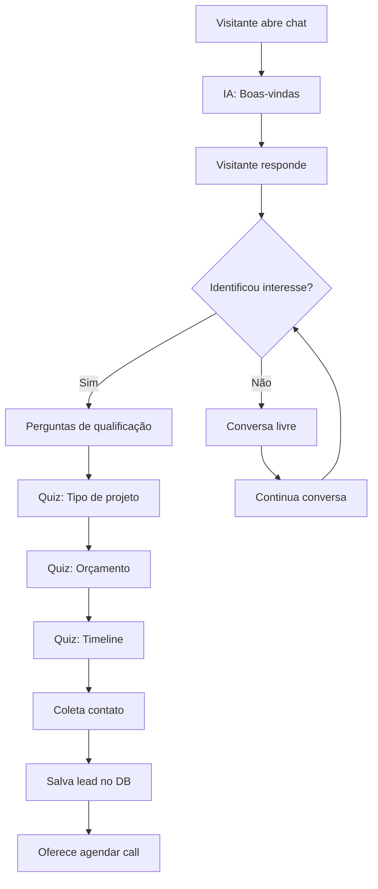

# 🤖 Chat SDR com IA - Proposta de Implementação

> Documento de planejamento para implementação de um chatbot de IA que atua como SDR (Sales Development Representative) na landing page da SupArt.

---

## 📋 Resumo Executivo

Um widget de chat inteligente que:
- Conversa naturalmente com visitantes
- Qualifica leads através de perguntas contextuais
- Aplica quizzes de forma orgânica na conversa
- Salva todos os dados para curadoria posterior

---

## 🏗️ Arquitetura Proposta

### 1. Frontend (Chat UI)

```
components/
├── ChatWidget.tsx          # Widget flutuante no canto
├── ChatMessage.tsx         # Bolhas de mensagem
├── ChatInput.tsx           # Input de texto
├── QuizCard.tsx            # Card de quiz interativo
└── ChatContext.tsx         # Estado global do chat
```

**Funcionalidades:**
- Widget flutuante (botão que abre chat)
- Interface tipo iMessage/WhatsApp
- Quiz com botões de múltipla escolha
- Indicador de "digitando..."
- Histórico de mensagens persistente (localStorage)

### 2. Backend (API Routes Next.js)

```
app/api/
├── chat/
│   └── route.ts            # POST - Processa mensagens com IA
├── lead/
│   └── route.ts            # POST - Salva lead qualificado
└── quiz/
    └── route.ts            # POST - Salva respostas do quiz
```

**Endpoints:**

| Endpoint | Método | Descrição |
|----------|--------|-----------|
| `/api/chat` | POST | Envia mensagem, recebe resposta da IA |
| `/api/lead` | POST | Salva lead com dados coletados |
| `/api/quiz` | POST | Salva resposta individual do quiz |

### 3. Banco de Dados (Supabase)

```sql
-- Tabela de conversas
CREATE TABLE conversations (
    id UUID PRIMARY KEY DEFAULT gen_random_uuid(),
    session_id TEXT NOT NULL,
    created_at TIMESTAMP DEFAULT NOW(),
    updated_at TIMESTAMP DEFAULT NOW(),
    status TEXT DEFAULT 'active' -- active, qualified, abandoned
);

-- Tabela de mensagens
CREATE TABLE messages (
    id UUID PRIMARY KEY DEFAULT gen_random_uuid(),
    conversation_id UUID REFERENCES conversations(id),
    role TEXT NOT NULL, -- 'user' ou 'assistant'
    content TEXT NOT NULL,
    created_at TIMESTAMP DEFAULT NOW()
);

-- Tabela de leads qualificados
CREATE TABLE leads (
    id UUID PRIMARY KEY DEFAULT gen_random_uuid(),
    conversation_id UUID REFERENCES conversations(id),
    name TEXT,
    email TEXT,
    phone TEXT,
    company TEXT,
    budget_range TEXT,
    project_type TEXT,
    timeline TEXT,
    qualified_at TIMESTAMP DEFAULT NOW()
);

-- Tabela de respostas do quiz
CREATE TABLE quiz_responses (
    id UUID PRIMARY KEY DEFAULT gen_random_uuid(),
    conversation_id UUID REFERENCES conversations(id),
    question_key TEXT NOT NULL,
    question_text TEXT NOT NULL,
    answer TEXT NOT NULL,
    created_at TIMESTAMP DEFAULT NOW()
);
```

---

## 🧠 System Prompt da IA

```markdown
Você é a Sofia, assistente virtual da SupArt - uma agência premium de design e desenvolvimento digital.

## Sua Personalidade:
- Simpática, profissional e objetiva
- Fala português brasileiro natural
- Usa emojis com moderação
- Demonstra expertise sem ser arrogante

## Seu Objetivo:
1. Acolher o visitante
2. Entender suas necessidades
3. Qualificar o lead através de perguntas naturais
4. Coletar informações de contato

## Perguntas de Qualificação (inserir naturalmente):
- Qual tipo de projeto está buscando? (site, app, branding)
- Qual o tamanho da empresa?
- Tem um prazo em mente?
- Tem um orçamento definido?
- Qual o melhor contato?

## Regras:
- Nunca prometa preços específicos
- Sempre ofereça agendar uma conversa com o time
- Se o visitante não quiser continuar, agradeça educadamente
- Nunca invente informações sobre a SupArt
```

---

## 🔄 Flow de Conversa



---

## 📦 Dependências Necessárias

```bash
# IA
npm install openai
# ou
npm install @anthropic-ai/sdk

# Banco de dados
npm install @supabase/supabase-js

# UI (opcional)
npm install framer-motion  # já instalado
```

---

## 💰 Custos Estimados

| Serviço | Custo |
|---------|-------|
| OpenAI GPT-4 Turbo | ~$0.01-0.03 por conversa |
| Anthropic Claude | ~$0.01-0.03 por conversa |
| Supabase (Free tier) | $0 até 500MB |
| Supabase (Pro) | $25/mês |

---

## 📝 Perguntas do Quiz

### 1. Tipo de Projeto
```
Qual tipo de projeto você está buscando?
[ ] Site/Landing Page
[ ] Aplicativo
[ ] E-commerce
[ ] Branding/Identidade Visual
[ ] Outro
```

### 2. Orçamento
```
Qual faixa de investimento você tem em mente?
[ ] Até R$ 5.000
[ ] R$ 5.000 - R$ 15.000
[ ] R$ 15.000 - R$ 50.000
[ ] Acima de R$ 50.000
[ ] Ainda não defini
```

### 3. Timeline
```
Qual seu prazo ideal?
[ ] Urgente (até 2 semanas)
[ ] 1-2 meses
[ ] 3-6 meses
[ ] Sem pressa
```

### 4. Empresa
```
Qual o tamanho da sua empresa?
[ ] Solo/Freelancer
[ ] Startup (1-10 pessoas)
[ ] PME (11-100 pessoas)
[ ] Grande empresa (100+)
```

---

## 🚀 Próximos Passos para Implementar

1. [ ] Escolher provedor de IA (OpenAI ou Anthropic)
2. [ ] Configurar Supabase (ou outro DB)
3. [ ] Criar tabelas no banco
4. [ ] Implementar API routes
5. [ ] Criar componentes do chat
6. [ ] Escrever system prompt refinado
7. [ ] Testar flow de conversa
8. [ ] Deploy e monitoramento

---

## 🔗 Integrações Futuras

- **CRM**: Pipedrive, HubSpot, Salesforce
- **Email**: SendGrid, Resend
- **Notificações**: Slack, Discord, WhatsApp
- **Analytics**: Mixpanel, Amplitude

---

*Documento criado em 12/12/2024 para estudo e planejamento futuro.*
